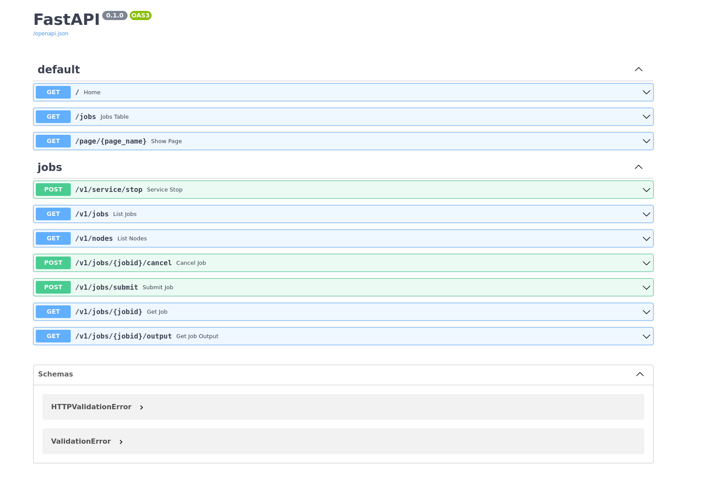

# Flux RESTFul API

<!-- ALL-CONTRIBUTORS-BADGE:START - Do not remove or modify this section -->
[](#contributors-)
<!-- ALL-CONTRIBUTORS-BADGE:END -->


This is a small Flux Python API (using FastAPI) that can be containerized
alongside Flux, and provide an easy means to interact with Flux via the API.
My goals are:

1. provide simple endpoints to submit jobs, list jobs, or get job status
2. eventually support subscribing to events and a user interface job table
3. option to kill or stop the server (intended for Flux Operator)
4. allow for start with a user name and token (for basic auth)

The assumption for my use case is that we deploy this on the fly,
alongside a Flux broker, and we only need to authenticate for the single
user case. For the Flux Operator, if we can start a mini-cluster running
a server and then submit jobs to it and have it taken down by API call,
that would be really cool (and is what I plan to test.)



🚧️ **under development!** 🚧️

## Usage

### Devcontainer

If you use VSCode a  [.devcontainer](.devcontainer) recipe is available that makes it easy to
spin up an environment just by way of opening the repository in VSCode! After doing
this, continue to [Local](#Local) below.

### Docker

You can use the [demo container](https://github.com/flux-framework/flux-restful-api/pkgs/container/flux-restful-api),
either as provided or build on your own, to
run the server and interact with it. To optionally build the container:

```bash
$ docker build -t ghcr.io/flux-framework/flux-restful-api .
```

To build ensuring there is authentication:

```bash
$ docker build --build-arg user=fluxuser --build-arg token=12345 --build-arg use_auth=true -t ghcr.io/flux-framework/flux-restful-api .
```

Build arguments supported are:

| Name | Description | Default |
|------|-------------|---------|
| user | Username for basic auth | unset |
| token | Token password for basic auth | unset |
| use_auth | Turn on authentication | unset (meaning false) |
| port | Port to run service on (and expose) | 5000 |
| host | Host to run service on (you probably shouldn't change this) |0.0.0.0 |

And run it ensuring you expose port 5000. The container should show you if you've
correctly provided auth (or not):

```bash
$ docker run --rm -it -p 5000:5000 ghcr.io/flux-framework/flux-restful-api
```
```console
🍓 Require auth: True
🍓    Flux user: ********
🍓   Flux token: *****
INFO:     Started server process [72]
INFO:     Waiting for application startup.
INFO:     Application startup complete.
INFO:     Uvicorn running on http://0.0.0.0:5000 (Press CTRL+C to quit)
```

Or run detached and then stop later:

```bash
$ docker run --name flux-restful -d --rm -it -p 5000:5000 ghcr.io/flux-framework/flux-restful-api
$ docker stop flux-restful
```


Either way, you can open your host to [http://127.0.0.1:5000](http://127.0.0.1:5000)
to see the very simple interface! This currently has API documentation (Openschema)
and we will soon add a table of jobs.


Once you have the server running, you can test out the example scripts!
You'll minimally need requests installed:

```bash
$ pip install requests
```

You should export the same flux user and password token if you added authentication:

```bash
$ export FLUX_USER=fluxuser
$ export FLUX_TOKEN=12345
```
```bash
$ python
```


See the [examples](examples) folder for more functionality.

### Local

You can use this setup locally (if you have flux and Python available) or within the Dev Container
in a VSCode environment.

#### 1. Install

Install dependencies:

```bash
$ python -m venv env
$ source env/bin/activate
$ pip install -r requirements.txt
```

Install requirements (note that you also need Flux Python available, which isn't in these requirements as you cannot install from pip).

```bash
$ pip install -r app-requirements.txt
```

#### 2. Start Service

There are two ways to start the app! You can either have it be the entry for flux start:

```console
$ flux start uvicorn app.main:app --host=0.0.0.0 --port=5000
```

Or do it separately (two commands):

```bash
$ flux start --test-size=4
$ uvicorn app.main:app --host=0.0.0.0 --port=5000
```

For the latter, you can also use the Makefile:

```bash
$ make
```
If you are developing, you must do the second approach as the server won't live-update
with the first.

#### 3. Authentication

If you want to require authentication for the user, export the user and token and
a variable that tells the server to use auth:

```bash
export FLUX_USER=$USER
export FLUX_TOKEN=123456
export FLUX_USER_AUTH=true
```

#### 4. Interactions

After starting, you can open your browser to [http://127.0.0.1:5000](http://127.0.0.1:5000)
to view the app interface. API endpoints are shown below, and see [examples](examples)
for a full client and example scripts to interact with your server. E.g., here
is an example:

```console
$ python3 examples/submit_job.py
```

To use authentication, you can either export your user and token to the environment, as before
(and they will be found by the client):

```bash
export FLUX_USER=$USER
export FLUX_TOKEN=123456
```
or if you cannot do this, the client can accept the username and password token at creation or
after it:

```python
# Make sure the directory with the client is in sys.path
from flux_restful_client import FluxRestfulClient

# create with username and token
cli = FluxRestfulClient(user="fluxuser", token="12345")

# Add or update after creation
cli.set_basic_auth(user="fluxuser", token="12345")
```
In addition, you can set the hostname (which defaults to localhost on port 5000):

```python
# create with username and token
cli = FluxRestfulClient('http://127.0.0.1:5000')
```

See the [examples](examples) folder for a mix of example (one with submit with auth)!

### API

The following is the spec for the Flux Python RESTful API provided here:

#### Service

##### POST `/service/stop`

Request to stop the server from running. This is intended for applications like
the Flux Operator that need programmatic ability to end the flux start command
and thus exit the job and bring down the mini-cluster.

#### Jobs

##### GET `/jobs`

List jobs owned by the flux executor (the current user).

##### GET `/jobs/{uid}`

Get a job with a specific identifier.

##### POST `/jobs/{uid}/cancel`

Request for a job cancellation based on identifier.

##### POST `/jobs/submit`

Submit a new job, required metadata in the post is:

 - command: a string of the command to run (required)
 - runtime: maximum runtime allowed (defaults to 0, unlimited, optional)

#### Nodes

#### GET `/nodes`

List cluster nodes.


## Development

Install development requirements:

```bash
$ pip install -r .github/dev-requirements.txt
```
And then run pre-commit manually, or install:

```bash
$ pre-commit run --all-files
```
Note that you should do this outside of the container!


## 😁️ Contributors 😁️

We use the [all-contributors](https://github.com/all-contributors/all-contributors)
tool to generate a contributors graphic below.

<!-- ALL-CONTRIBUTORS-LIST:START - Do not remove or modify this section -->
<!-- prettier-ignore-start -->
<!-- markdownlint-disable -->
<table>
  <tbody>
    <tr>
      <td align="center" valign="top" width="14.28%"><a href="https://vsoch.github.io"><br /><sub><b>Vanessasaurus</b></sub></a><br /><a href="https://github.com/flux-framework/flux-restful-api/commits?author=vsoch" title="Code">💻</a></td>
    </tr>
  </tbody>
</table>

<!-- markdownlint-restore -->
<!-- prettier-ignore-end -->

<!-- ALL-CONTRIBUTORS-LIST:END -->


## TODO

- Interface view with nice job table
- We can put additional assets for the server in [data](data), not sure what those are yet!

#### Release

SPDX-License-Identifier: LGPL-3.0

LLNL-CODE-764420
