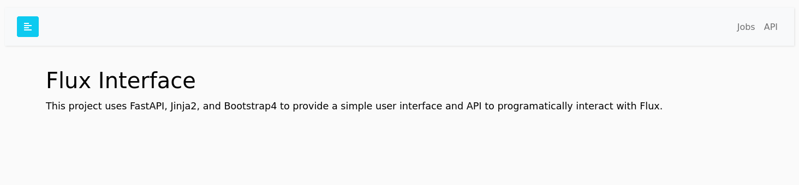

# Developer Guide

This developer guide includes complete instructions for setting up a developer
environment.

### Devcontainer

If you use VSCode a  [.devcontainer](https://github.com/flux-framework/flux-restful-api/tree/main/.devcontainer)
recipe is available that makes it easy to spin up an environment just by way of opening the repository in VSCode! After doing
this, continue to [Local](#Local) below.

### Docker

You can use the [demo container](https://github.com/flux-framework/flux-restful-api/pkgs/container/flux-restful-api),
either as provided or build on your own, to
run the server and interact with it. To optionally build the container:

```bash
$ docker build -t ghcr.io/flux-framework/flux-restful-api .
```

To build ensuring there is authentication (this will use user and token defaults)

```bash
$ docker build --build-arg use_auth=true -t ghcr.io/flux-framework/flux-restful-api .
```

Or define extra builds args `--build-arg user=fluxuser --build-arg token=12345` to customize the username and token!
Build arguments supported are:

| Name | Description | Default |
|------|-------------|---------|
| user | Username for basic auth | unset |
| token | Token password for basic auth | unset |
| use_auth | Turn on authentication | unset (meaning false) |
| port | Port to run service on (and expose) | 5000 |
| host | Host to run service on (you probably shouldn't change this) |0.0.0.0 |

And run it ensuring you expose port 5000. The container should show you if you've
correctly provided auth (or not):

```bash
$ docker run --rm -it -p 5000:5000 ghcr.io/flux-framework/flux-restful-api
```
```console
🍓 Require auth: True
🍓    Flux user: ********
🍓   Flux token: *****
INFO:     Started server process [72]
INFO:     Waiting for application startup.
INFO:     Application startup complete.
INFO:     Uvicorn running on http://0.0.0.0:5000 (Press CTRL+C to quit)
```

Or run detached and then stop later:

```bash
$ docker run --name flux-restful -d --rm -it -p 5000:5000 ghcr.io/flux-framework/flux-restful-api
$ docker stop flux-restful
```

Finally, if you want to install a custom branch (and/or repository) of the RESTFul API, we provide
an environment variable to do this. E.g., this makes it easy to test a custom branch in CI without
needing to push a container to a registry. Here is how to specify a branch (and default to flux-framework/flux-restful-api)
or your own repository base:

```bash
$ docker run  --env INSTALL_BRANCH=add/feature --env INSTALL_REPO=user/flux-restful-api -d --rm -it -p 5000:5000 ghcr.io/flux-framework/flux-restful-api
```


### Local

You can use this setup locally (if you have flux and Python available) or within the Dev Container
in a VSCode environment.

#### 1. Install

After cloning the repository, install dependencies:

```bash
$ python -m venv env
$ source env/bin/activate
$ pip install -r requirements.txt
```

Install requirements (note that you also need Flux Python available, which isn't in these requirements as you cannot install from pip).

```bash
$ pip install -r app-requirements.txt
```

#### 2. Start Service

There are two ways to start the app! You can either have it be the entry for flux start:

```console
$ flux start uvicorn app.main:app --host=0.0.0.0 --port=5000
```

Or do it separately (two commands):

```bash
$ flux start --test-size=4
$ uvicorn app.main:app --host=0.0.0.0 --port=5000
```

For the latter, you can also use the Makefile:

```bash
$ make
```
If you are developing, you must do the second approach as the server won't live-update
with the first.

#### 3. Authentication

If you want to require authentication for the user, export the user and token and
a variable that tells the server to use auth:

```bash
export FLUX_USER=$USER
export FLUX_TOKEN=123456
export FLUX_USER_AUTH=true
```

### Interactions

Regardless of how you install, you can open your host to [http://127.0.0.1:5000](http://127.0.0.1:5000)
to see the very simple interface! This currently has API documentation ([openapi](https://fastapi.tiangolo.com/advanced/extending-openapi/))
and we will soon add a table of jobs.



Once you have the server running, you can use an example client to interact
with the server. See our [User Guide](https://flux-framework.org/flux-restful-api/getting_started/user-guide.html) for these instructions.

## Environment

Wherever you run the app, you can control variables (settings) via the environment.
The following variables are available (with their defaults):

| Name | Description | Default |
|------|-------------|---------|
|FLUX_REQUIRE_AUTH| The server should require basic auth for API and authenticated endpoints | False (unset) |
|FLUX_TOKEN| The token password to require for Basic Auth (if `FLUX_REQUIRE_AUTH` is set) | unset |
|FLUX_USER| The username to require for Basic Auth (if `FLUX_REQUIRE_AUTH` is set) | unset |
|FLUX_HAS_GPU | GPUs are available for the user to request | unset |
|FLUX_NUMBER_NODES| The number of nodes available in the cluster | 1 |

## Code Linting

We use [pre-commit](https://pre-commit.com/) to handle code linting and formatting, including:

 - black
 - isort
 - flake8

Our setup also handles line endings and ensuring that you don't add large files!

Using the tools is easy. After preparing your local environment,
you can use pre-commit as follows. Here is a manual run:

```bash
$ pre-commit run --all-files
```
```console
check for added large files..............................................Passed
check for case conflicts.................................................Passed
check docstring is first.................................................Passed
fix end of files.........................................................Passed
trim trailing whitespace.................................................Passed
mixed line ending........................................................Passed
black....................................................................Passed
isort....................................................................Passed
flake8...................................................................Passed
```

And to install as a hook (recommended so you never commit with linting flaws!)

```bash
$ pre-commit install
```


## Documentation

The documentation is provided in the `docs` folder of the repository,
and generally most content that you might want to add is under
`getting_started`. For ease of contribution, files that are likely to be
updated by contributors (e.g., mostly everything but the module generated files)
 are written in markdown. If you need to use [toctree](https://www.sphinx-doc.org/en/master/usage/restructuredtext/directives.html#table-of-contents) you should not use extra newlines or spaces (see index.md files for examples). The documentation is also provided in Markdown (instead of rst or restructured syntax)
to make contribution easier for the community.

Finally, we recommend you use the same development environment also to build and work on
documentation. The reason is because we import the app to derive docstrings,
and this will require having Flux.

**NOTE** to build the documentation you will need an unauthenticated flux endpoint
running. E.g., in another terminal:

```bash
$ flux start uvicorn app.main:app --host=0.0.0.0 --port=5000
```

### Install Dependencies and Build

The documentation is built using sphinx, and generally you can install
dependencies (done in devcontainer):

```console
cd docs
pip install -r requirements.txt

# Build the docs into _build/html
make html
```

### Preview Documentation

After `make html` you can enter into `_build/html` and start a local web
server to preview:

```console
$ python -m http.server 9999
```

And open your browser to `localhost:9999`


### Run Tests

To run tests, from within the devcontainers environment (or with a local install)
of Flux alongside the app) you can do:

```bash
$ flux start pytest -xs tests/test_api.py
```

### Docstrings

To render our Python API into the docs, we keep an updated restructured
syntax in the `docs/source` folder that you can update on demand as
follows:

```console
$ ./apidoc.sh
```

This should only be required if you change any docstrings or add/remove
functions from oras-py source code.
