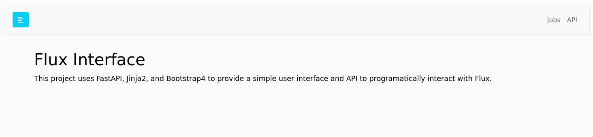

# Developer Guide

This developer guide includes complete instructions for setting up a developer
environment.

### Devcontainer

If you use VSCode a  [.devcontainer](https://github.com/flux-framework/flux-restful-api/tree/main/.devcontainer)
recipe is available that makes it easy to spin up an environment just by way of opening the repository in VSCode! After doing
this, continue to [Local](#Local) below.

### Docker

You can use the [demo container](https://github.com/flux-framework/flux-restful-api/pkgs/container/flux-restful-api),
either as provided or build on your own, to
run the server and interact with it. To optionally build the container:

```bash
$ docker build -t ghcr.io/flux-framework/flux-restful-api .
```

To build ensuring there is authentication (this will use user and token defaults)

```bash
$ docker build --build-arg use_auth=true -t ghcr.io/flux-framework/flux-restful-api .
```

Or define extra builds args `--build-arg user=fluxuser --build-arg token=12345` to customize the username and token!
Build arguments supported are:

| Name | Description | Default |
|------|-------------|---------|
| user | Username for basic auth | unset |
| token | Token password for basic auth | unset |
| use_auth | Turn on authentication | unset (meaning false) |
| port | Port to run service on (and expose) | 5000 |
| host | Host to run service on (you probably shouldn't change this) |0.0.0.0 |
| workers | Number of workers to run uvicorn with (required for Flux jobs with >1 process) | 1 |

And run it ensuring you expose port 5000. The container should show you if you've
correctly provided auth (or not):

```bash
$ docker run --rm -it -p 5000:5000 ghcr.io/flux-framework/flux-restful-api
```
```console
🍓 Require auth: True
🍓  Server mode: single-user
🍓   Secret key ***********
🍓    Flux user: ********
🍓   Flux token: *****
collected 5 items
INFO:     Started server process [72]
INFO:     Waiting for application startup.
INFO:     Application startup complete.
INFO:     Uvicorn running on http://0.0.0.0:5000 (Press CTRL+C to quit)
```

Or run detached and then stop later:

```bash
$ docker run --name flux-restful -d --rm -it -p 5000:5000 ghcr.io/flux-framework/flux-restful-api
$ docker stop flux-restful
```

Finally, if you want to install a custom branch (and/or repository) of the RESTFul API, we provide
an environment variable to do this. E.g., this makes it easy to test a custom branch in CI without
needing to push a container to a registry. Here is how to specify a branch (and default to flux-framework/flux-restful-api)
or your own repository base:

```bash
$ docker run --env INSTALL_BRANCH=add/feature --env INSTALL_REPO=user/flux-restful-api -d --rm -it -p 5000:5000 ghcr.io/flux-framework/flux-restful-api
```


### Local

You can use this setup locally (if you have flux and Python available) or within the Dev Container
in a VSCode environment.

#### 1. Install

After cloning the repository, install dependencies:

```bash
$ python -m venv env
$ source env/bin/activate
```

Install requirements (note that you also need Flux Python available, which isn't in these requirements as you cannot install from pip).

```bash
pip install -r requirements.txt
```

#### 2. Start Service

There are two ways to start the app! You can either have it be the entry for flux start:

```console
$ flux start uvicorn app.main:app --host=0.0.0.0 --port=5000
```

Or do it separately (two commands):

```bash
flux start --test-size=4
uvicorn app.main:app --host=0.0.0.0 --port=5000
```

For the latter, you can also use the Makefile:

```bash
$ make
```

If you are developing, you must do the second approach as the server won't live-update
with the first. If you want to start flux running as a separate process:

```bash
sudo -u flux /usr/bin/flux broker \
  --config-path=/etc/flux/system/conf.d \
  -Scron.directory=/etc/flux/system/cron.d \
  -Srundir=/run/flux \
  -Sstatedir=${STATE_DIRECTORY:-/var/lib/flux} \
  -Slocal-uri=local:///run/flux/local \
  -Slog-stderr-level=6 \
  -Slog-stderr-mode=local \
  -Sbroker.rc2_none \
  -Sbroker.quorum=0 \
  -Sbroker.quorum-timeout=none \
  -Sbroker.exit-norestart=42 \
  -Scontent.restore=auto &
```

And then we need munge to be started (this should be done by the devcontainer):

```bash
$ sudo service munge start
```

And export any authentication envars you need before running make.

```bash
export FLUX_URI=local:///run/flux/local
$ sudo -E make
```

#### 3. Authentication

Authentication is off by default (`FLUX_AUTH_BACKEND=none`). To require it, choose a backend
and provide what it needs. For database users, which is what the Python client and the Flux
Operator use, export the superuser credentials and the keys, then initialize the database:

```bash
export FLUX_AUTH_BACKEND=shared-secret
export FLUX_USER=$USER
export FLUX_TOKEN=123456
export FLUX_SECRET_KEY=$(openssl rand -hex 32)
export FLUX_TOKEN_SIGNING_KEY=$(openssl rand -hex 32)
make init
```

`FLUX_REQUIRE_AUTH=true` is still accepted and means the same as `FLUX_AUTH_BACKEND=shared-secret`.

To authenticate against system accounts instead, install `python-pam` and use the `pam` backend.
PAM can only check other users' passwords when the server runs as root. Superusers are listed
explicitly:

```bash
export FLUX_AUTH_BACKEND=pam
export FLUX_ADMIN_USERS=$USER
```

For multi-user mode (`FLUX_SERVER_MODE=multi-user`) jobs run as the authenticated system
user. The Flux instance is started first as the `flux` user with guest access and flux-imp
configured (see [example/multi-user](https://github.com/flux-framework/flux-restful-api/tree/main/example/multi-user)),
with `allow-root-owner = true`, which lets the root server act as the instance owner (read any
jobspec, cancel any job), and the server is started by root: for each submission it becomes the user, whose own
`flux python` signs and submits the jobspec, so no sudoers rules are needed. The server
refuses to start in multi-user mode as any other user. PAM is the natural backend here,
because every authenticated name is a system account; `database` works too if the database
usernames match system accounts.

Ownership is enforced for a job's details, output, and cancellation: in multi-user mode a
job belongs to the uid it runs as, and in single-user mode (where every job runs as the
server user) to the API user who submitted it, recorded in the jobspec. Superusers may act
on any job. In single-user mode the job listing is shared.

To accept tokens issued by an OpenID Connect provider:

```bash
export FLUX_AUTH_BACKEND=oidc
export FLUX_OIDC_ISSUER=https://accounts.example.com
export FLUX_OIDC_AUDIENCE=my-client-id
```

The username is the token's `sub` claim, the only claim OIDC guarantees to be stable and
unique, so `FLUX_ADMIN_USERS` should list subjects. Claims such as `preferred_username` or
`email` can be chosen with `FLUX_OIDC_USERNAME_CLAIM`, but only if your provider guarantees
they are unique and not user-editable. In multi-user mode, where the username is the system
account jobs run as, that variable must be set to a claim that maps to local accounts, and
accounts below `FLUX_MIN_UID` (root, daemons) are refused whatever the claim says.

See the [User Guide](https://flux-framework.org/flux-restful-api/getting_started/user-guide.html)
for how clients log in with each backend, and the environment table below for every variable.

### Interactions

Regardless of how you install, you can open your host to [http://127.0.0.1:5000](http://127.0.0.1:5000)
to see the very simple interface! This currently has API documentation ([openapi](https://fastapi.tiangolo.com/advanced/extending-openapi/))
and we will soon add a table of jobs.



Once you have the server running, you can use an example client to interact
with the server. See our [User Guide](https://flux-framework.org/flux-restful-api/getting_started/user-guide.html) for these instructions.

## Environment

Wherever you run the app, you can control variables (settings) via the environment.
The following variables are available (with their defaults):

| Name | Description | Default |
|------|-------------|---------|
|FLUX_AUTH_BACKEND| Authentication backend: `none`, `database`, `shared-secret`, `pam`, or `oidc` | none |
|FLUX_REQUIRE_AUTH| Deprecated: `true` is the same as `FLUX_AUTH_BACKEND=shared-secret` | unset |
|FLUX_USER| Username of the database superuser created by `init_db.py init` | fluxuser |
|FLUX_TOKEN| Password of the database superuser created by `init_db.py init` | unset |
|FLUX_ADMIN_USERS| Comma separated usernames that are superusers with any backend | unset |
|FLUX_TOKEN_SIGNING_KEY| Server-only key that signs access tokens; required for backends that issue tokens and shared by all workers | unset (entrypoint.sh generates one per container start) |
|FLUX_PAM_SERVICE| PAM service name for the `pam` backend | login |
|FLUX_MIN_UID| Lowest uid a backend may map a login to (`pam`, and `oidc` in multi-user mode); root and daemons are refused | 1000 |
|FLUX_OIDC_ISSUER| OpenID Connect issuer URL (`oidc` backend, required) | unset |
|FLUX_OIDC_AUDIENCE| Expected token audience, usually the client id (`oidc` backend, required) | unset |
|FLUX_OIDC_JWKS_URL| JWKS URL, if it cannot be discovered from the issuer | discovered |
|FLUX_OIDC_USERNAME_CLAIM| Token claim used as the username (`oidc` backend); required in multi-user mode | sub |
|FLUX_HAS_GPU | GPUs are available for the user to request | unset |
|FLUX_NUMBER_NODES| The number of nodes available (exposed) in the cluster | 1 |
|FLUX_OPTION_FLAGS | Option flags to give to flux, in the same format you'd give on the command line | unset |
|FLUX_JOB_ENV_PASSTHROUGH | Extra server environment variables (comma separated names or patterns, e.g. `CUDA_*,OMP_NUM_THREADS`) to pass to jobs and launchers | unset |
|FLUX_SECRET_KEY | Secret shared with clients to encode the `/v1/token` handshake (required for `shared-secret`) | unset |
|FLUX_ACCESS_TOKEN_EXPIRES_MINUTES| number of minutes to expire an access token | 600 |
|FLUX_RESTFUL_HOST| Host for command line client | http://127.0.0.1:5000 |


### Job Environment

Jobs do not inherit the server's environment. They get a fixed allowlist (PATH, HOME, locale
variables, PYTHONPATH, LD_LIBRARY_PATH, and the Flux paths exported by `flux start`) plus any
variables in the submit request, and the job shell provides FLUX_URI and the FLUX_JOB_* variables
itself. This keeps server settings and secrets such as FLUX_TOKEN out of jobs. If your deployment
relies on other variables reaching jobs, for example CUDA_*, OMP_*, or a CONDA or SPACK
environment, list them in `FLUX_JOB_ENV_PASSTHROUGH`:

```bash
export FLUX_JOB_ENV_PASSTHROUGH="CUDA_*,OMP_NUM_THREADS,CONDA_PREFIX"
```

Launchers (nextflow, snakemake) run on the server rather than inside a job, so they get the same
allowlist plus FLUX_URI in order to submit their jobs to this instance.

### Flux Option Flags

Option flags can be set server-wide or on the fly by a user in the interface
(or restful API). An option set by a user will over-ride the server setting.
An example setting a server-level option flags is below:

```bash
export FLUX_OPTION_FLAGS="-ompi=openmpi@5"
```

This would be translated to:

```python
fluxjob = flux.job.JobspecV1.from_command(command, **kwargs)
fluxjob.setattr_shell_option("mpi", "openmpi@5")
```

And note that you can easily set more than one:

```bash
export FLUX_OPTION_FLAGS="-ompi=openmpi@5 -okey=value"
```

## Code Linting

We use [pre-commit](https://pre-commit.com/) to handle code linting and formatting, including:

 - black
 - isort
 - flake8

Our setup also handles line endings and ensuring that you don't add large files!

Using the tools is easy. After preparing your local environment,
you can use pre-commit as follows. Here is a manual run:

```bash
$ pre-commit run --all-files
```
```console
check for added large files..............................................Passed
check for case conflicts.................................................Passed
check docstring is first.................................................Passed
fix end of files.........................................................Passed
trim trailing whitespace.................................................Passed
mixed line ending........................................................Passed
black....................................................................Passed
isort....................................................................Passed
flake8...................................................................Passed
```

And to install as a hook (recommended so you never commit with linting flaws!)

```bash
$ pre-commit install
```

## Database

The database config was created with:

```bash
$ alembic init --template generic ./migrations
```

At this point we need to edit `migrations/env.py` so it could see our database models. This part:

```python
# This line was added so we import our database
from app.db.base import Base  # noqa

target_metadata = Base.metadata
```

At this point we can do a migration to create the initial (empty) tables.

```bash
$ alembic revision --autogenerate -m "Create intital tables"
```

And then to run the first set of migrations:

```bash
$ alembic upgrade head
```

At this point we can create our initial super flux user:

```bash
export FLUX_USER=fluxuser
export FLUX_TOKEN=12345
```
```bash
$ python app/db/init_db.py init
```
```console
# python app/db/init_db.py init

INFO:__main__:Creating initial data
INFO:__main__:User fluxuser has been created.
INFO:__main__:Initial data created
```

or add a user:

```bash
$ python app/db/init_db.py add-user peenut peenut
```
```console
INFO:__main__:User peenut has been created.
```

You can see how we run these commands in the `entrypoint.sh` for the container.
The database is always created fresh, and the flux user and token (superuser)
are always generated from the environment variables shown above.

## Documentation

The documentation is provided in the `docs` folder of the repository,
and generally most content that you might want to add is under
`getting_started`. For ease of contribution, files that are likely to be
updated by contributors (e.g., mostly everything but the module generated files)
 are written in markdown. If you need to use [toctree](https://www.sphinx-doc.org/en/master/usage/restructuredtext/directives.html#table-of-contents) you should not use extra newlines or spaces (see index.md files for examples). The documentation is also provided in Markdown (instead of rst or restructured syntax)
to make contribution easier for the community.

Finally, we recommend you use the same development environment also to build and work on
documentation. The reason is because we import the app to derive docstrings,
and this will require having Flux.

**NOTE** to build the documentation you will need an unauthenticated flux endpoint
running. E.g., in another terminal:

```bash
$ flux start uvicorn app.main:app --host=0.0.0.0 --port=5000
```

### Install Dependencies and Build

The documentation is built using sphinx, and generally you can install
dependencies (done in devcontainer):

```console
cd docs
pip install -r requirements.txt

# Ensure auth is off
unset FLUX_REQUIRE_AUTH

# And build the docs into _build/html
make html
```

### Preview Documentation

After `make html` you can enter into `_build/html` and start a local web
server to preview:

```console
$ python -m http.server 9999
```

And open your browser to `localhost:9999`


### Run Tests

To run tests, from within the devcontainers environment (or with a local install)
of Flux alongside the app) you can use flux start. You will need to run them as the
flux instance owner. E.g., if it's flux:

```bash
$ sudo -u flux flux start pytest -xs tests/test_api.py
```

or if it's just root / a single user:

```bash
$ flux start pytest -xs tests/test_api.py
```

### Docstrings

To render our Python API into the docs, we keep an updated restructured
syntax in the `docs/source` folder that you can update on demand as
follows:

```console
$ ./apidoc.sh
```

This should only be required if you change any docstrings or add/remove
functions from oras-py source code.
