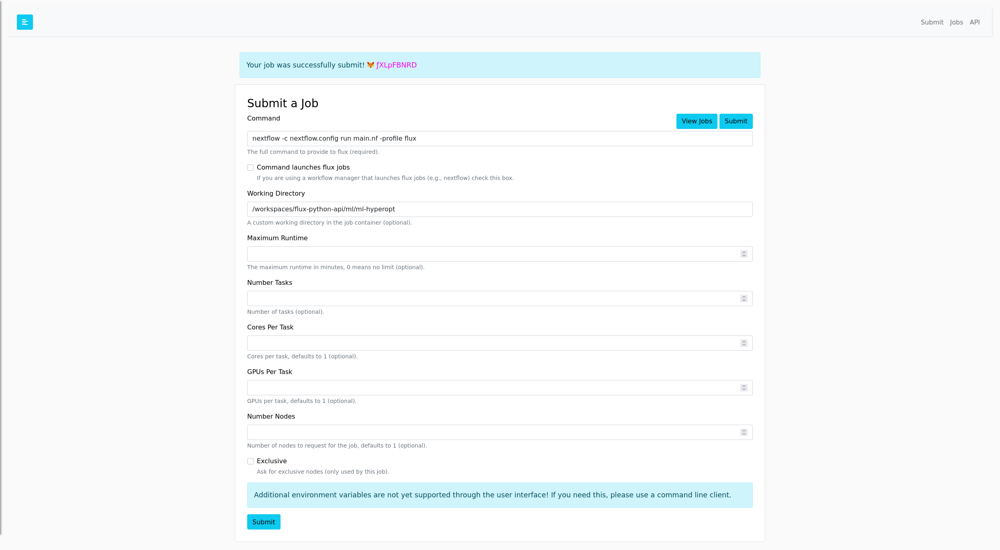
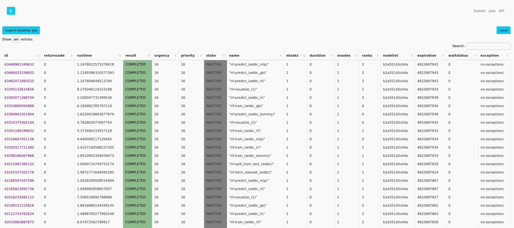
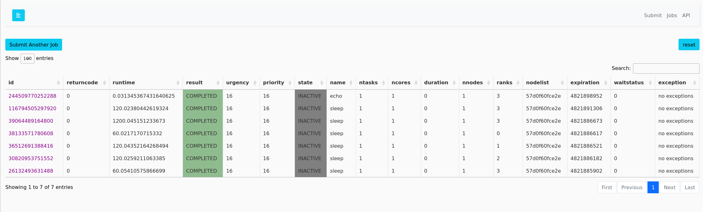
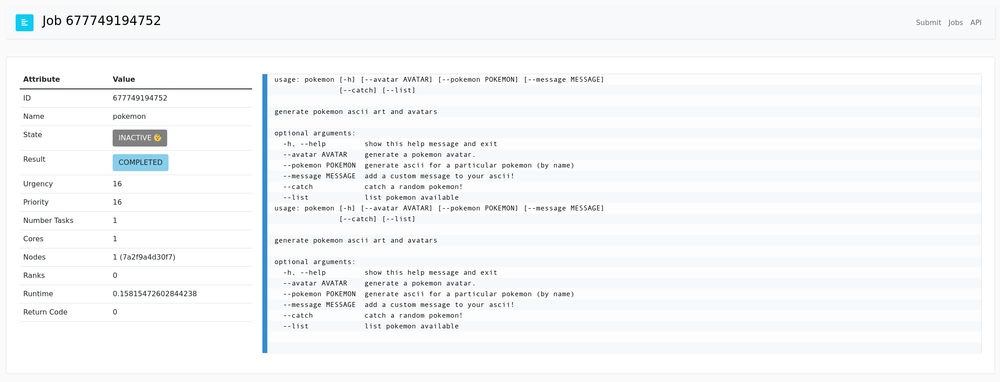
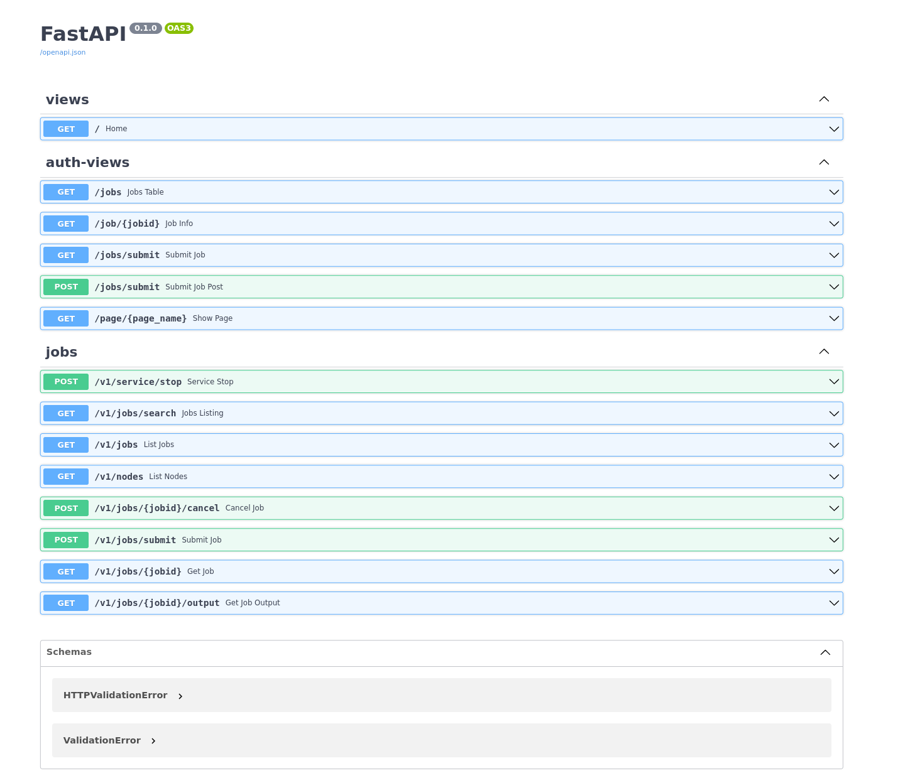

# Interface

The following interfaces are provided by the Flux Python RESTful API.
If you deploy a server with authentication, all views except for the home page
will be behind a basic authentication (asking for a user name and password).
For the API, you'll be able to see endpoints but not interact with them.
Note that these endpoints are distinct from the [API](https://flux-framework.org/flux-restful-api/getting_started/api.html) in that
they are not prefixed with "v1."

## Home

### `GET /`

The home screen (portal) is the only page that is always available without authentication.
It's quite useless, really, aside to say hello 👋! Yes. you've found it. Good job.
It's so boring I'm not even going to show it.

## Jobs

### `GET /jobs/submit`

You likely want to submit jobs, and then see them progress. We first do this via the Submit portal:

Notice that there is a checkbox for a "launcher" - current launchers supported
are NextFlow and Snakemake. Essentially, a launcher is going to submit multiple
Flux jobs for you instead of providing a single command to flux. When you submit
via a NextFlow launcher, for example, the one command results in many jobs:

### `GET /jobs`

And then the jobs table to view all jobs:

### `GET /jobs/<jobid>`

And then clicking a job id will show you job info, and the latest log.

You can refresh the page
to re-request the logs, and maybe someday we will have a fancy-shmancy thing that automatically
does this. For now I'd rather not make longer or additional requests to Flux if it's not necessary.

## API

### `GET /docs`

To interact with the API (or see available endpoints) you can go to this view.

