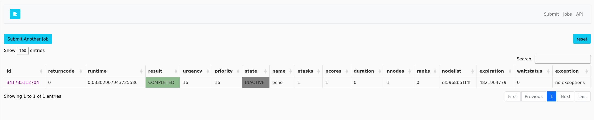
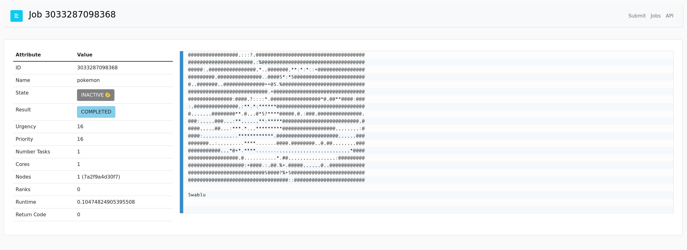

# Container Tutorial

If you don't want to use a command line client (or you want to do a quick tutorial just using an interface)
this one is for you! You can run our demo container as follows:

```bash
$ docker run -it -p 5000:5000 ghcr.io/flux-framework/flux-restful-api:latest
```

To start the image. Then open your browser to [http://0.0.0.0:5000](http://0.0.0.0:5000).
Note for those adventurous - you *can* in fact use this server to test the clients below! But
this is not required.

1. Go to the "Submit" interface in the navigation to ask to submit a job.
2. We recommend something with output like `echo pancakes 🥞🥞🥞🥞🥞`
3. Then click on "View Jobs" to see your job.



And then explore other API endpoints by clicking "Docs." And that's it!
If you want to build a similar container with your own software, we recommend you
use this as a base container, ensure your needed executables are on the path,
and then you can submit jobs to your heart's content. Here is an example:

```dockerfile
FROM ghcr.io/flux-framework/flux-restful-api:latest
RUN pip install pokemon
```

To build locally:

```bash
$ docker build -t flux-pokemon .
```

And run the same as before to submit a job. But this time... we have access to generate ascii-art pokemon!



Yay! But seriously, you should like, do real science work. Only dinosaurs generate pokemon!
